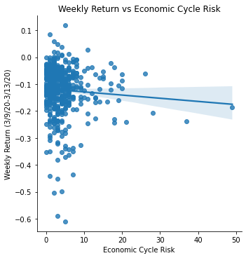

# Midterm Analysis Report


```python
#importing needed packages

import pandas as pd
import seaborn as sns
from statsmodels.formula.api import ols as sm_ols
```

## <span style = "color:blue"> Section I: Discussion of Risk Measurements </span>

### Risk Measurements Description

1. Risk is inherently an ambiguous term that does not have a single, clear definition or a standardized measurement metric. Depending on the person, context, and environment, a single risk factor can be perceived and measured in numerous different ways, each way resulting in a different measurement. For the purposes of this analysis, I took a very interesting approach to measuring risk. After determining the types of risk I wanted to capture, I manually parsed through a small portion of the annual 10-K reports of my firm sample (S&P 500 firms) so as to identify combinations of words and phrases that were frequently cited by the writers of the annual reports when addressing the 3 types of risk that I wanted to capture. Upon collecting a reasonably sized sample of such words/phrases, I used them as the input to a parsing function that returned the number of matches it found for each combination of words/phrases within each 10-K of my firm sample. Using this technique, known as Natural Language Processing, I was able to come up with concrete measurements for each of my risk types. 

2. The three types of risk that I chose to measure are as follows: 
  - **Economic Cycle Risk:** The idea behind this risk type was to capture the extent to which the firms in my sample were vulnerable to systematic, macroeconomic risk factors (for example - a pandemic-induced recession), and general economic fluctuations. I decided to measure this as I anticipated that firms within the consumer durables/discretionary sectors generally suffer in periods of economic downturn (as was the case in March 2020), and wanted to see whether the results of my analysis were in accordance with this expectation)
  - **Regulatory Risk:** The goal of this risk type was to capture the extent to which the firms in my sample considered themselves susceptible to changes regulatory laws, government intervention, and international business rules. I chose this risk type as I thought it was something that nearly all publicly-traded firms have to deal with, and was interested in seeing which firms viewed themselves as particularly vulnerable in this area. 
  - **Environmental Risk:** The purpose of this risk variable was to identify the firms that viewed themselves as particularly endangered by environmental concerns such as fossil fuel reliance, climate change, natural disasters, etc. I chose to measure this risk type, as I believe mitigating environmental risk is something that the corporate worlds holds significant responsibility over and was curious to see the results. 
  
3. Overall, I am satisfied with the statistical properties of all my risk variables. Each risk type had at least one variable with a standard deviation of 4 hits or higher, and the maximum values across the variables ranged from 11 to 48 hits, which is indicative of solid variation in each variable. I also found the percentage of values that were zeroes for each of my risk variables, and discovered that most variables were in the 10-20% range, and none were over the 50% mark, which is also solid. For more statistical information, refer to the tables below: 

| Risk Variable | Percentage of Values = 0 |
| ----------- | ----------- |
| Economic Cycle Risk | 10.57% |
| Regulatory Risk 1| 10.16% |
| Regulatory Risk 2| 44.71% |
| Regulatory Risk 3| 5.08% |
| Environmental Risk | 30.08% |


```python
#load output file from measure_risk

csv_file = "output/sp500_accting_plus_textrisks.csv"
firmsAcctRisks = pd.read_csv(csv_file) 
firmsAcctRisks = firmsAcctRisks.drop(['Unnamed: 0'], axis=1)

firmsAcctRisks[["Economic Cycle Risk", "Regulatory Risk 1", "Regulatory Risk 2", "Regulatory Risk 3", "Environmental Risk"]].describe()
```


<div>
<style scoped>
    .dataframe tbody tr th:only-of-type {
        vertical-align: middle;
    }

    .dataframe tbody tr th {
        vertical-align: top;
    }

    .dataframe thead th {
        text-align: right;
    }
</style>
<table border="1" class="dataframe">
  <thead>
    <tr style="text-align: right;">
      <th></th>
      <th>Economic Cycle Risk</th>
      <th>Regulatory Risk 1</th>
      <th>Regulatory Risk 2</th>
      <th>Regulatory Risk 3</th>
      <th>Environmental Risk</th>
    </tr>
  </thead>
  <tbody>
    <tr>
      <th>count</th>
      <td>492.000000</td>
      <td>492.000000</td>
      <td>492.000000</td>
      <td>492.000000</td>
      <td>492.000000</td>
    </tr>
    <tr>
      <th>mean</th>
      <td>4.154472</td>
      <td>5.140244</td>
      <td>1.260163</td>
      <td>6.123984</td>
      <td>3.071138</td>
    </tr>
    <tr>
      <th>std</th>
      <td>4.785897</td>
      <td>7.436537</td>
      <td>1.730698</td>
      <td>4.802290</td>
      <td>4.119525</td>
    </tr>
    <tr>
      <th>min</th>
      <td>0.000000</td>
      <td>0.000000</td>
      <td>0.000000</td>
      <td>0.000000</td>
      <td>0.000000</td>
    </tr>
    <tr>
      <th>25%</th>
      <td>1.000000</td>
      <td>2.000000</td>
      <td>0.000000</td>
      <td>3.000000</td>
      <td>0.000000</td>
    </tr>
    <tr>
      <th>50%</th>
      <td>3.000000</td>
      <td>3.000000</td>
      <td>1.000000</td>
      <td>5.000000</td>
      <td>1.000000</td>
    </tr>
    <tr>
      <th>75%</th>
      <td>5.000000</td>
      <td>5.000000</td>
      <td>2.000000</td>
      <td>8.000000</td>
      <td>4.000000</td>
    </tr>
    <tr>
      <th>max</th>
      <td>49.000000</td>
      <td>58.000000</td>
      <td>11.000000</td>
      <td>31.000000</td>
      <td>25.000000</td>
    </tr>
  </tbody>
</table>
</div>


### Risk Measurments Validation Checks

*Prior to moving on, I'd like to reinforce the fact that risk is a subjective term that each individual interprets for themselves, meaning that it is difficult to evaluate the validity of any risk measurement. I believe risk measurement via NLP is an intelligent method to measure risk that has both its strengths and weaknesses, and will try to address them from my point of view below.*

#### <span style = "color:green"> Validation Check 1: Examples of Risk Matches </span>

Below are several examples of risk matches for three random firms that were correctly picked up by my parsing function in *measure_risk.ipynb*, which can be viewed as evidence that the risk measurements are working as intended. 

**Economic Cycle Risk:**
1. *Apple, Inc:* "Consumer confidence and spending could be adversely affected in response to financial market **volatility**, negative financial news, conditions in the real estate and mortgage markets, **declines** in income or asset values, changes to fuel and other energy costs, labor and healthcare costs and other **economic** factors."
2. *Etsy, Inc:* "If general **economic** conditions **deteriorate** in the United States or other markets where we operate, consumer discretionary spending may **decline** and demand for the goods and services available in our platform may be reduced."
3. *The Bank of America Corporation:* "Increased market **volatility** and adverse changes in other financial or capital market conditions may increase our market **risk**."

**Regulatory Risk:**
1. *Apple, Inc:* "The Company is subject to complex and changing **laws** and **regulations** worldwide, which exposes the Company to potential **liabilities**, increased costs and other **adverse** effects on the Company’s business."
2. *Etsy, Inc:* "GDPR, CCPA, and similar **laws** coming into effect in other jurisdictions may continue to change the data protection landscape globally and could result in potentially significant operational costs for internal **compliance** and **risk** to our business. "
3. *The Bank of America Corporation:* "Changes to existing U.S. **laws** and **regulatory** policies, including those related to financial regulation, taxation, international trade, fiscal policy and healthcare, may **adversely** impact U.S. or global economic activity and our customers', counterparties' and the Corporation's earnings and operations."

**Environmental Risk:**
1. *Apple, Inc:* "Global **climate** **change** could result in certain types of **natural disasters** occurring more frequently or with more intense effects, and consequently **disrupting** the company's operations."
2. *Etsy, Inc:* "**Natural disasters** and other **adverse** weather and **climate** conditions, public health crises, political instability or crises, terrorist attacks, war or other unexpected events, could **disrupt** our operations, internet or mobile networks, or the operations of one or more of our third-party service providers."
3. *The Bank of America Corporation:* "Additionally, decreases in home price valuations or commercial real estate valuations in certain markets where we have large concentrations, including as a result of **climate change** or **natural disasters** (e.g., rising sea levels, hurricanes and fires), as well as more broadly within the U.S. or globally, could result in increased defaults, delinquencies or credit **instability**."

#### <span style = "color:green"> Validation Check 2: Firms with the Highest Scores for Each Risk Type </span>

**Firms with Highest Economic Cycle Risk**


```python
highEconRisk = firmsAcctRisks.loc[firmsAcctRisks['Economic Cycle Risk'] >= 20]
highEconRisk = highEconRisk[['Symbol', 'Security']]
highEconRisk
```


<div>
<style scoped>
    .dataframe tbody tr th:only-of-type {
        vertical-align: middle;
    }

    .dataframe tbody tr th {
        vertical-align: top;
    }

    .dataframe thead th {
        text-align: right;
    }
</style>
<table border="1" class="dataframe">
  <thead>
    <tr style="text-align: right;">
      <th></th>
      <th>Symbol</th>
      <th>Security</th>
    </tr>
  </thead>
  <tbody>
    <tr>
      <th>14</th>
      <td>AIG</td>
      <td>AIG</td>
    </tr>
    <tr>
      <th>59</th>
      <td>BAC</td>
      <td>Bank of America</td>
    </tr>
    <tr>
      <th>82</th>
      <td>COF</td>
      <td>Capital One</td>
    </tr>
    <tr>
      <th>191</th>
      <td>FITB</td>
      <td>Fifth Third Bank</td>
    </tr>
    <tr>
      <th>305</th>
      <td>MET</td>
      <td>MetLife</td>
    </tr>
    <tr>
      <th>360</th>
      <td>PBCT</td>
      <td>People's United Financial</td>
    </tr>
    <tr>
      <th>368</th>
      <td>PNC</td>
      <td>PNC Financial Services</td>
    </tr>
    <tr>
      <th>376</th>
      <td>PRU</td>
      <td>Prudential</td>
    </tr>
  </tbody>
</table>
</div>


**Firms with Highest Regulatory Risk**


```python
highRegRisk = firmsAcctRisks.loc[firmsAcctRisks['Regulatory Risk 3'] >= 20]
highRegRisk = highRegRisk[['Symbol', 'Security']]
highRegRisk
```


<div>
<style scoped>
    .dataframe tbody tr th:only-of-type {
        vertical-align: middle;
    }

    .dataframe tbody tr th {
        vertical-align: top;
    }

    .dataframe thead th {
        text-align: right;
    }
</style>
<table border="1" class="dataframe">
  <thead>
    <tr style="text-align: right;">
      <th></th>
      <th>Symbol</th>
      <th>Security</th>
    </tr>
  </thead>
  <tbody>
    <tr>
      <th>0</th>
      <td>MMM</td>
      <td>3M</td>
    </tr>
    <tr>
      <th>15</th>
      <td>APD</td>
      <td>Air Products</td>
    </tr>
    <tr>
      <th>60</th>
      <td>BAX</td>
      <td>Baxter</td>
    </tr>
    <tr>
      <th>121</th>
      <td>ED</td>
      <td>Con Edison</td>
    </tr>
    <tr>
      <th>126</th>
      <td>CTVA</td>
      <td>Corteva</td>
    </tr>
    <tr>
      <th>164</th>
      <td>EIX</td>
      <td>Edison International</td>
    </tr>
    <tr>
      <th>169</th>
      <td>ETR</td>
      <td>Entergy</td>
    </tr>
    <tr>
      <th>220</th>
      <td>HIG</td>
      <td>Hartford (The)</td>
    </tr>
    <tr>
      <th>282</th>
      <td>LIN</td>
      <td>Linde</td>
    </tr>
    <tr>
      <th>305</th>
      <td>MET</td>
      <td>MetLife</td>
    </tr>
    <tr>
      <th>372</th>
      <td>PFG</td>
      <td>Principal</td>
    </tr>
    <tr>
      <th>376</th>
      <td>PRU</td>
      <td>Prudential</td>
    </tr>
    <tr>
      <th>387</th>
      <td>RJF</td>
      <td>Raymond James</td>
    </tr>
    <tr>
      <th>415</th>
      <td>SO</td>
      <td>Southern Company</td>
    </tr>
  </tbody>
</table>
</div>


**Firms with Highest Environmental Risk**


```python
highEnvRisk = firmsAcctRisks.loc[firmsAcctRisks['Environmental Risk'] >= 18]
highEnvRisk = highEnvRisk[['Symbol', 'Security']]
highEnvRisk
```


<div>
<style scoped>
    .dataframe tbody tr th:only-of-type {
        vertical-align: middle;
    }

    .dataframe tbody tr th {
        vertical-align: top;
    }

    .dataframe thead th {
        text-align: right;
    }
</style>
<table border="1" class="dataframe">
  <thead>
    <tr style="text-align: right;">
      <th></th>
      <th>Symbol</th>
      <th>Security</th>
    </tr>
  </thead>
  <tbody>
    <tr>
      <th>120</th>
      <td>COP</td>
      <td>ConocoPhillips</td>
    </tr>
    <tr>
      <th>121</th>
      <td>ED</td>
      <td>Con Edison</td>
    </tr>
    <tr>
      <th>143</th>
      <td>DLR</td>
      <td>Digital Realty</td>
    </tr>
    <tr>
      <th>170</th>
      <td>EOG</td>
      <td>EOG Resources</td>
    </tr>
    <tr>
      <th>181</th>
      <td>EXC</td>
      <td>Exelon</td>
    </tr>
    <tr>
      <th>196</th>
      <td>FMC</td>
      <td>FMC</td>
    </tr>
    <tr>
      <th>316</th>
      <td>MDLZ</td>
      <td>Mondelez International</td>
    </tr>
    <tr>
      <th>321</th>
      <td>MOS</td>
      <td>Mosaic</td>
    </tr>
    <tr>
      <th>377</th>
      <td>PEG</td>
      <td>PSEG</td>
    </tr>
  </tbody>
</table>
</div>


#### <span style = "color:green"> Discussion of Validation Checks and Validity of Risk Measurements </span>

Validation Check 1 allows us to see the types of sentences that the parsing function has picked up for each risk measure, thereby showing that (for the most part) the keywords that were inputted into the parsing function adequately capture the type of risk I was trying to measure. Obviously, this risk measure is quite restrictive, as it only looks at a very tiny sample of matches, but it still increases my confidence in the chosen keywords for each risk variable. 

Validation Check 2 prints out the companies that had the highest number of hits for each type of risk, and provides some significant insights. 
 - For economic cycle risk, all firms that were printed out are in the financial services industry, which is no coincidence. In times of economic downturn, consumer spending is low and interest rates drop, both of which are detrimental factors for banks and other players in financial services, as low consumer spending means there is very low demand for creditor services and plummeting interest rates carve into the profitability of financial firms. 
 - As for the firms with the highest regulatory risk, there were players across many different industries, contrary to economic cycle risk. In my view, this also makes a lot of sense, given that virtually all industries are in some way impacted by governmental intervention, tax laws, and changing regulatory requirements. With this in mind, it is little surprise that there is such a wide mix of firms in the bracket of firms with high regulatory risk
 - When it comes to environmental risk, the riskiest firms for this factor appear to be companies in the Energy, Raw Materials Mining, and Real Estate sectors. This discovery is once again aligned with my expectations, given that these are all sectors that are particularly vulnerable to environmental factors such as catastrophic weather conditions, climate change, and the transition to renewable energy. Real Estate companies, like DLR, rely on their fixed PP&E assets for profitability, and natural disasters due to adverse weather conditions pose a significant threat to them. Energy and Mining firms, on the other hand, are not only vulnerable to severe atmospheric conditions, but are also threatened by sustainability concerns, and the changing public sentiment towards renewable energy sources. 
 
**Conclusion:** Validation Checks 1 & 2 provide decent evidence supporting the validity of my risk measures and reaffirming the adequacy of NLP as a viable method for risk measurement. Nonetheless, this NLP does have some weaknesses that the reader should be aware of, the most important one being the possibility of false positives skewing the final measurements. While I was very careful in selecting the keyword criteria for matches and was unable to find any potential false positives when manually parsing, I cannot say with complete confidence that in taking these precautions I was able to prevent the parsing function from picking up any false positives. Another potential weakness is the fact that, the "Risk Factors" section of a 10-K report is very carefully written for the purposes of warning potential investors, and may not represent the true scale of risk that a company faces at a given time. Given the evidence and analysis done in this section, **it is ultimately up to the reader to determine the level of confidence that they have in my risk measurements.**

## <span style = "color:blue"> Section II: Final Sample EDA </span>  


```python
#find the returns for SP500 firms for the week of 3.9.20-3.13.20
firm_rets = pd.read_stata("2019-2020-stock_rets cleaned.dta")

firm_rets = firm_rets[['date', 'ticker', 'ret']]

firm_rets = firm_rets[(firm_rets['date'] == 20200309) |
                      (firm_rets['date'] == 20200310) |
                      (firm_rets['date'] == 20200311) |
                      (firm_rets['date'] == 20200312) |
                      (firm_rets['date'] == 20200313)]

firm_rets['ret'] = pd.to_numeric(firm_rets['ret'])

firm_rets['wkly_ret'] = (1 + firm_rets['ret'])

firm_rets_grouped = firm_rets.groupby(['ticker'])
wkly_rets = firm_rets_grouped['wkly_ret'].prod()-1

wkly_returns = wkly_rets.to_frame()

wkly_returns = wkly_returns.reset_index()

#merge everything together
FinalDF = firmsAcctRisks.merge(wkly_returns, 
                                left_on = 'Symbol',
                                right_on = 'ticker', 
                                how='left')

FinalDF = FinalDF.drop(['ticker'], axis=1)
```

**Shape (columns, rows) of final sample:**


```python
 FinalDF.shape
```


    (492, 47)


**Column + Storage Info:**


```python
FinalDF.info()
```

    <class 'pandas.core.frame.DataFrame'>
    Int64Index: 492 entries, 0 to 491
    Data columns (total 47 columns):
     #   Column               Non-Null Count  Dtype  
    ---  ------               --------------  -----  
     0   Symbol               492 non-null    object 
     1   Security             492 non-null    object 
     2   Economic Cycle Risk  492 non-null    float64
     3   Regulatory Risk 1    492 non-null    float64
     4   Regulatory Risk 2    492 non-null    float64
     5   Regulatory Risk 3    492 non-null    float64
     6   Environmental Risk   492 non-null    float64
     7   gvkey                352 non-null    float64
     8   lpermno              352 non-null    float64
     9   datadate             352 non-null    object 
     10  fyear                352 non-null    float64
     11  sic                  352 non-null    float64
     12  sic3                 352 non-null    float64
     13  td                   352 non-null    float64
     14  long_debt_dum        352 non-null    float64
     15  me                   352 non-null    float64
     16  l_a                  352 non-null    float64
     17  l_sale               352 non-null    float64
     18  div_d                352 non-null    float64
     19  age                  352 non-null    float64
     20  atr                  352 non-null    float64
     21  smalltaxlosscarry    273 non-null    float64
     22  largetaxlosscarry    273 non-null    float64
     23  l_emp                352 non-null    float64
     24  l_ppent              352 non-null    float64
     25  l_laborratio         352 non-null    float64
     26  Inv                  352 non-null    float64
     27  Ch_Cash              352 non-null    float64
     28  Div                  352 non-null    float64
     29  Ch_Debt              352 non-null    float64
     30  Ch_Eqty              352 non-null    float64
     31  Ch_WC                352 non-null    float64
     32  CF                   352 non-null    float64
     33  td_a                 352 non-null    float64
     34  td_mv                352 non-null    float64
     35  mb                   352 non-null    float64
     36  prof_a               352 non-null    float64
     37  ppe_a                352 non-null    float64
     38  cash_a               352 non-null    float64
     39  xrd_a                352 non-null    float64
     40  dltt_a               352 non-null    float64
     41  invopps_FG09         331 non-null    float64
     42  sales_g              0 non-null      float64
     43  dv_a                 352 non-null    float64
     44  short_debt           346 non-null    float64
     45  _merge               492 non-null    object 
     46  wkly_ret             488 non-null    float64
    dtypes: float64(43), object(4)
    memory usage: 184.5+ KB
    

**Number of unique values for select variables:**


```python
FinalDF[['Economic Cycle Risk', 'Regulatory Risk 1', 'Regulatory Risk 3', 'Regulatory Risk 2', 'Environmental Risk']].nunique()
```


    Economic Cycle Risk    26
    Regulatory Risk 1      36
    Regulatory Risk 3      28
    Regulatory Risk 2      11
    Environmental Risk     24
    dtype: int64


**Final Sample Summary Statistics:**


```python
view = FinalDF.drop(['Economic Cycle Risk', 'Regulatory Risk 1', 'Regulatory Risk 3', 'Regulatory Risk 2', 'Environmental Risk'],axis=1)
view.describe().T
```


<div>
<style scoped>
    .dataframe tbody tr th:only-of-type {
        vertical-align: middle;
    }

    .dataframe tbody tr th {
        vertical-align: top;
    }

    .dataframe thead th {
        text-align: right;
    }
</style>
<table border="1" class="dataframe">
  <thead>
    <tr style="text-align: right;">
      <th></th>
      <th>count</th>
      <th>mean</th>
      <th>std</th>
      <th>min</th>
      <th>25%</th>
      <th>50%</th>
      <th>75%</th>
      <th>max</th>
    </tr>
  </thead>
  <tbody>
    <tr>
      <th>gvkey</th>
      <td>352.0</td>
      <td>45655.275568</td>
      <td>61312.551897</td>
      <td>1045.000000</td>
      <td>6357.250000</td>
      <td>13973.000000</td>
      <td>61612.250000</td>
      <td>3.160560e+05</td>
    </tr>
    <tr>
      <th>lpermno</th>
      <td>352.0</td>
      <td>53572.482955</td>
      <td>30231.047786</td>
      <td>10104.000000</td>
      <td>19474.750000</td>
      <td>58246.000000</td>
      <td>82644.250000</td>
      <td>9.343600e+04</td>
    </tr>
    <tr>
      <th>fyear</th>
      <td>352.0</td>
      <td>2018.886364</td>
      <td>0.317821</td>
      <td>2018.000000</td>
      <td>2019.000000</td>
      <td>2019.000000</td>
      <td>2019.000000</td>
      <td>2.019000e+03</td>
    </tr>
    <tr>
      <th>sic</th>
      <td>352.0</td>
      <td>4330.014205</td>
      <td>1949.495636</td>
      <td>100.000000</td>
      <td>2849.250000</td>
      <td>3786.000000</td>
      <td>5507.750000</td>
      <td>8.742000e+03</td>
    </tr>
    <tr>
      <th>sic3</th>
      <td>352.0</td>
      <td>432.784091</td>
      <td>194.979666</td>
      <td>10.000000</td>
      <td>284.750000</td>
      <td>378.500000</td>
      <td>550.750000</td>
      <td>8.740000e+02</td>
    </tr>
    <tr>
      <th>td</th>
      <td>352.0</td>
      <td>12119.868341</td>
      <td>21713.135840</td>
      <td>0.000000</td>
      <td>1817.975000</td>
      <td>5079.242500</td>
      <td>12152.750000</td>
      <td>1.884020e+05</td>
    </tr>
    <tr>
      <th>long_debt_dum</th>
      <td>352.0</td>
      <td>0.982955</td>
      <td>0.129625</td>
      <td>0.000000</td>
      <td>1.000000</td>
      <td>1.000000</td>
      <td>1.000000</td>
      <td>1.000000e+00</td>
    </tr>
    <tr>
      <th>me</th>
      <td>352.0</td>
      <td>57432.237628</td>
      <td>116693.961167</td>
      <td>2963.886500</td>
      <td>13191.317000</td>
      <td>22455.288000</td>
      <td>51945.526250</td>
      <td>1.023856e+06</td>
    </tr>
    <tr>
      <th>l_a</th>
      <td>352.0</td>
      <td>9.708541</td>
      <td>1.229763</td>
      <td>6.569794</td>
      <td>8.800306</td>
      <td>9.686929</td>
      <td>10.557991</td>
      <td>1.322070e+01</td>
    </tr>
    <tr>
      <th>l_sale</th>
      <td>352.0</td>
      <td>9.317635</td>
      <td>1.256966</td>
      <td>4.097822</td>
      <td>8.472732</td>
      <td>9.231821</td>
      <td>10.018299</td>
      <td>1.314555e+01</td>
    </tr>
    <tr>
      <th>div_d</th>
      <td>352.0</td>
      <td>0.744318</td>
      <td>0.436865</td>
      <td>0.000000</td>
      <td>0.000000</td>
      <td>1.000000</td>
      <td>1.000000</td>
      <td>1.000000e+00</td>
    </tr>
    <tr>
      <th>age</th>
      <td>352.0</td>
      <td>0.000000</td>
      <td>0.000000</td>
      <td>0.000000</td>
      <td>0.000000</td>
      <td>0.000000</td>
      <td>0.000000</td>
      <td>0.000000e+00</td>
    </tr>
    <tr>
      <th>atr</th>
      <td>352.0</td>
      <td>0.234018</td>
      <td>0.235356</td>
      <td>0.000000</td>
      <td>0.125926</td>
      <td>0.199817</td>
      <td>0.241626</td>
      <td>1.000000e+00</td>
    </tr>
    <tr>
      <th>smalltaxlosscarry</th>
      <td>273.0</td>
      <td>0.721612</td>
      <td>0.449029</td>
      <td>0.000000</td>
      <td>0.000000</td>
      <td>1.000000</td>
      <td>1.000000</td>
      <td>1.000000e+00</td>
    </tr>
    <tr>
      <th>largetaxlosscarry</th>
      <td>273.0</td>
      <td>0.197802</td>
      <td>0.399074</td>
      <td>0.000000</td>
      <td>0.000000</td>
      <td>0.000000</td>
      <td>0.000000</td>
      <td>1.000000e+00</td>
    </tr>
    <tr>
      <th>l_emp</th>
      <td>352.0</td>
      <td>3.327105</td>
      <td>1.160559</td>
      <td>0.455524</td>
      <td>2.440164</td>
      <td>3.263833</td>
      <td>4.197118</td>
      <td>6.025866e+00</td>
    </tr>
    <tr>
      <th>l_ppent</th>
      <td>352.0</td>
      <td>7.904878</td>
      <td>1.546549</td>
      <td>3.690204</td>
      <td>6.795529</td>
      <td>7.825421</td>
      <td>9.037236</td>
      <td>1.111335e+01</td>
    </tr>
    <tr>
      <th>l_laborratio</th>
      <td>352.0</td>
      <td>4.650632</td>
      <td>1.317926</td>
      <td>0.511044</td>
      <td>3.834218</td>
      <td>4.385719</td>
      <td>5.330502</td>
      <td>9.931146e+00</td>
    </tr>
    <tr>
      <th>Inv</th>
      <td>352.0</td>
      <td>0.054387</td>
      <td>0.084964</td>
      <td>-0.329408</td>
      <td>0.020732</td>
      <td>0.048013</td>
      <td>0.089258</td>
      <td>4.238831e-01</td>
    </tr>
    <tr>
      <th>Ch_Cash</th>
      <td>352.0</td>
      <td>0.008847</td>
      <td>0.065049</td>
      <td>-0.315808</td>
      <td>-0.007998</td>
      <td>0.003960</td>
      <td>0.023985</td>
      <td>3.837106e-01</td>
    </tr>
    <tr>
      <th>Div</th>
      <td>352.0</td>
      <td>0.025462</td>
      <td>0.027004</td>
      <td>0.000000</td>
      <td>0.000000</td>
      <td>0.020492</td>
      <td>0.037559</td>
      <td>1.385936e-01</td>
    </tr>
    <tr>
      <th>Ch_Debt</th>
      <td>352.0</td>
      <td>0.014027</td>
      <td>0.072364</td>
      <td>-0.265326</td>
      <td>-0.019568</td>
      <td>0.000000</td>
      <td>0.031572</td>
      <td>4.217628e-01</td>
    </tr>
    <tr>
      <th>Ch_Eqty</th>
      <td>352.0</td>
      <td>-0.042757</td>
      <td>0.058526</td>
      <td>-0.282758</td>
      <td>-0.062731</td>
      <td>-0.023404</td>
      <td>-0.002746</td>
      <td>1.741915e-01</td>
    </tr>
    <tr>
      <th>Ch_WC</th>
      <td>352.0</td>
      <td>0.011417</td>
      <td>0.044580</td>
      <td>-0.252402</td>
      <td>-0.005327</td>
      <td>0.006631</td>
      <td>0.024374</td>
      <td>3.726431e-01</td>
    </tr>
    <tr>
      <th>CF</th>
      <td>352.0</td>
      <td>0.123344</td>
      <td>0.077283</td>
      <td>-0.288764</td>
      <td>0.074645</td>
      <td>0.113733</td>
      <td>0.162095</td>
      <td>3.332969e-01</td>
    </tr>
    <tr>
      <th>td_a</th>
      <td>352.0</td>
      <td>0.328435</td>
      <td>0.192516</td>
      <td>0.000000</td>
      <td>0.204722</td>
      <td>0.319227</td>
      <td>0.432302</td>
      <td>1.245754e+00</td>
    </tr>
    <tr>
      <th>td_mv</th>
      <td>352.0</td>
      <td>0.185137</td>
      <td>0.140769</td>
      <td>0.000000</td>
      <td>0.092256</td>
      <td>0.160139</td>
      <td>0.262688</td>
      <td>8.095309e-01</td>
    </tr>
    <tr>
      <th>mb</th>
      <td>352.0</td>
      <td>3.027132</td>
      <td>2.091248</td>
      <td>0.877849</td>
      <td>1.583681</td>
      <td>2.412643</td>
      <td>3.655906</td>
      <td>1.308288e+01</td>
    </tr>
    <tr>
      <th>prof_a</th>
      <td>352.0</td>
      <td>0.151264</td>
      <td>0.074569</td>
      <td>-0.323828</td>
      <td>0.101974</td>
      <td>0.138951</td>
      <td>0.186640</td>
      <td>3.903839e-01</td>
    </tr>
    <tr>
      <th>ppe_a</th>
      <td>352.0</td>
      <td>0.247675</td>
      <td>0.219468</td>
      <td>0.009521</td>
      <td>0.091756</td>
      <td>0.162726</td>
      <td>0.336247</td>
      <td>9.285623e-01</td>
    </tr>
    <tr>
      <th>cash_a</th>
      <td>352.0</td>
      <td>0.126782</td>
      <td>0.138790</td>
      <td>0.002073</td>
      <td>0.032281</td>
      <td>0.072970</td>
      <td>0.167961</td>
      <td>6.946123e-01</td>
    </tr>
    <tr>
      <th>xrd_a</th>
      <td>352.0</td>
      <td>0.031364</td>
      <td>0.050330</td>
      <td>0.000000</td>
      <td>0.000000</td>
      <td>0.009533</td>
      <td>0.043306</td>
      <td>3.367946e-01</td>
    </tr>
    <tr>
      <th>dltt_a</th>
      <td>352.0</td>
      <td>0.295314</td>
      <td>0.181393</td>
      <td>0.000000</td>
      <td>0.176565</td>
      <td>0.283319</td>
      <td>0.386684</td>
      <td>1.071959e+00</td>
    </tr>
    <tr>
      <th>invopps_FG09</th>
      <td>331.0</td>
      <td>2.702297</td>
      <td>2.106053</td>
      <td>0.405435</td>
      <td>1.250688</td>
      <td>2.160294</td>
      <td>3.298536</td>
      <td>1.216423e+01</td>
    </tr>
    <tr>
      <th>sales_g</th>
      <td>0.0</td>
      <td>NaN</td>
      <td>NaN</td>
      <td>NaN</td>
      <td>NaN</td>
      <td>NaN</td>
      <td>NaN</td>
      <td>NaN</td>
    </tr>
    <tr>
      <th>dv_a</th>
      <td>352.0</td>
      <td>0.025462</td>
      <td>0.027004</td>
      <td>0.000000</td>
      <td>0.000000</td>
      <td>0.020492</td>
      <td>0.037559</td>
      <td>1.385936e-01</td>
    </tr>
    <tr>
      <th>short_debt</th>
      <td>346.0</td>
      <td>0.112720</td>
      <td>0.111597</td>
      <td>0.000000</td>
      <td>0.026783</td>
      <td>0.085531</td>
      <td>0.152638</td>
      <td>7.610294e-01</td>
    </tr>
    <tr>
      <th>wkly_ret</th>
      <td>488.0</td>
      <td>-0.122035</td>
      <td>0.090437</td>
      <td>-0.610145</td>
      <td>-0.159448</td>
      <td>-0.106716</td>
      <td>-0.065169</td>
      <td>1.177476e-01</td>
    </tr>
  </tbody>
</table>
</div>


#### Potential Caveats with Final Sample Data

1. A decent amount of the accounting data has missing values, which could skew the analysis in the next section. </br></br>
2. According to the atr variable (average tax rate) there are a significant number of companies with a tax rate of 100%. Also, the firm age variable is 0 across all rows. Both of these are obviously wrong, and cannot be used in my analysis. </br></br>
3. The SEC Edgar Downloader failed to download 13 out the 10-Ks for the S&P 500, which reduced the number of observations for the risk variables to 492. </br></br>
4. The return values are only compounded weekly return for the week of 3/9/20 through 3/13/20, which may not be truly reflective of the pandemic's impact on the firm's performance. </br></br>
5. The risk variables are measured using NLP from the 10-Ks which, as previously mentioned, may or may not adequately reflect the true risk faced by the firms. 

## <span style = "color:blue"> Section III: Visual and Correlation Analysis

#### <span style = "color:green"> Risk Variables Analysis and Visualization </span>

**Economic Cycle Risk**


```python
plot = sns.lmplot(data=FinalDF, 
           x = 'Economic Cycle Risk', y='wkly_ret').set(title = 'Weekly Return vs Economic Cycle Risk', 
                                                        ylabel = 'Weekly Return (3/9/20-3/13/20)')
plot;
```


    

    


```python
econRegression = sm_ols('wkly_ret ~ Q("Economic Cycle Risk")',data = FinalDF).fit().summary()
econRegression

```


<table class="simpletable">
<caption>OLS Regression Results</caption>
<tr>
  <th>Dep. Variable:</th>        <td>wkly_ret</td>     <th>  R-squared:         </th> <td>   0.004</td>
</tr>
<tr>
  <th>Model:</th>                   <td>OLS</td>       <th>  Adj. R-squared:    </th> <td>   0.002</td>
</tr>
<tr>
  <th>Method:</th>             <td>Least Squares</td>  <th>  F-statistic:       </th> <td>   1.908</td>
</tr>
<tr>
  <th>Date:</th>             <td>Fri, 25 Mar 2022</td> <th>  Prob (F-statistic):</th>  <td> 0.168</td> 
</tr>
<tr>
  <th>Time:</th>                 <td>14:52:00</td>     <th>  Log-Likelihood:    </th> <td>  481.73</td>
</tr>
<tr>
  <th>No. Observations:</th>      <td>   488</td>      <th>  AIC:               </th> <td>  -959.5</td>
</tr>
<tr>
  <th>Df Residuals:</th>          <td>   486</td>      <th>  BIC:               </th> <td>  -951.1</td>
</tr>
<tr>
  <th>Df Model:</th>              <td>     1</td>      <th>                     </th>     <td> </td>   
</tr>
<tr>
  <th>Covariance Type:</th>      <td>nonrobust</td>    <th>                     </th>     <td> </td>   
</tr>
</table>
<table class="simpletable">
<tr>
              <td></td>                <th>coef</th>     <th>std err</th>      <th>t</th>      <th>P>|t|</th>  <th>[0.025</th>    <th>0.975]</th>  
</tr>
<tr>
  <th>Intercept</th>                <td>   -0.1172</td> <td>    0.005</td> <td>  -21.672</td> <td> 0.000</td> <td>   -0.128</td> <td>   -0.107</td>
</tr>
<tr>
  <th>Q("Economic Cycle Risk")</th> <td>   -0.0012</td> <td>    0.001</td> <td>   -1.381</td> <td> 0.168</td> <td>   -0.003</td> <td>    0.000</td>
</tr>
</table>
<table class="simpletable">
<tr>
  <th>Omnibus:</th>       <td>169.381</td> <th>  Durbin-Watson:     </th> <td>   2.112</td> 
</tr>
<tr>
  <th>Prob(Omnibus):</th> <td> 0.000</td>  <th>  Jarque-Bera (JB):  </th> <td> 632.670</td> 
</tr>
<tr>
  <th>Skew:</th>          <td>-1.559</td>  <th>  Prob(JB):          </th> <td>4.14e-138</td>
</tr>
<tr>
  <th>Kurtosis:</th>      <td> 7.626</td>  <th>  Cond. No.          </th> <td>    8.47</td> 
</tr>
</table><br/><br/>Notes:<br/>[1] Standard Errors assume that the covariance matrix of the errors is correctly specified.


**Findings**: As initially anticipated, there is a very slight negative correlation between weekly returns and economic cycle risk, which tells us that on average, firms with higher vulnerability to economic fluctuations performed worse during the early days of the COVID outbreak. Overall, the predictive ability of the "Economic Cycle Risk" variable is low, with an R^2 value of 0.4%, and a t-value of 1.38 of the slope coefficient indicates that the negative correlation between the 2 variables in this case may not be statistically significant. 

**Regulatory Risk**


```python
plot = sns.lmplot(data=FinalDF, 
           x = 'Regulatory Risk 1', y='wkly_ret').set(title = 'Weekly Return vs Regulatory Risk 1', 
                                                        ylabel = 'Weekly Return (3/9/20-3/13/20)')
plot;
```


    

    


```python
plot = sns.lmplot(data=FinalDF, 
           x = 'Regulatory Risk 2', y='wkly_ret').set(title = 'Weekly Return vs Regulatory Risk 2', 
                                                        ylabel = 'Weekly Return (3/9/20-3/13/20)')
plot;
```


    

    


```python
plot = sns.lmplot(data=FinalDF, 
           x = 'Regulatory Risk 3', y='wkly_ret').set(title = 'Weekly Return vs Regulatory Risk 3', 
                                                        ylabel = 'Weekly Return (3/9/20-3/13/20)')
plot;
```


    

    


```python
regulateRegression = sm_ols('wkly_ret ~ Q("Regulatory Risk 2")',data = FinalDF).fit().summary()
regulateRegression
```


<table class="simpletable">
<caption>OLS Regression Results</caption>
<tr>
  <th>Dep. Variable:</th>        <td>wkly_ret</td>     <th>  R-squared:         </th> <td>   0.004</td>
</tr>
<tr>
  <th>Model:</th>                   <td>OLS</td>       <th>  Adj. R-squared:    </th> <td>   0.002</td>
</tr>
<tr>
  <th>Method:</th>             <td>Least Squares</td>  <th>  F-statistic:       </th> <td>   2.019</td>
</tr>
<tr>
  <th>Date:</th>             <td>Fri, 25 Mar 2022</td> <th>  Prob (F-statistic):</th>  <td> 0.156</td> 
</tr>
<tr>
  <th>Time:</th>                 <td>14:52:01</td>     <th>  Log-Likelihood:    </th> <td>  481.78</td>
</tr>
<tr>
  <th>No. Observations:</th>      <td>   488</td>      <th>  AIC:               </th> <td>  -959.6</td>
</tr>
<tr>
  <th>Df Residuals:</th>          <td>   486</td>      <th>  BIC:               </th> <td>  -951.2</td>
</tr>
<tr>
  <th>Df Model:</th>              <td>     1</td>      <th>                     </th>     <td> </td>   
</tr>
<tr>
  <th>Covariance Type:</th>      <td>nonrobust</td>    <th>                     </th>     <td> </td>   
</tr>
</table>
<table class="simpletable">
<tr>
             <td></td>               <th>coef</th>     <th>std err</th>      <th>t</th>      <th>P>|t|</th>  <th>[0.025</th>    <th>0.975]</th>  
</tr>
<tr>
  <th>Intercept</th>              <td>   -0.1262</td> <td>    0.005</td> <td>  -24.997</td> <td> 0.000</td> <td>   -0.136</td> <td>   -0.116</td>
</tr>
<tr>
  <th>Q("Regulatory Risk 2")</th> <td>    0.0034</td> <td>    0.002</td> <td>    1.421</td> <td> 0.156</td> <td>   -0.001</td> <td>    0.008</td>
</tr>
</table>
<table class="simpletable">
<tr>
  <th>Omnibus:</th>       <td>163.529</td> <th>  Durbin-Watson:     </th> <td>   2.107</td> 
</tr>
<tr>
  <th>Prob(Omnibus):</th> <td> 0.000</td>  <th>  Jarque-Bera (JB):  </th> <td> 578.426</td> 
</tr>
<tr>
  <th>Skew:</th>          <td>-1.522</td>  <th>  Prob(JB):          </th> <td>2.49e-126</td>
</tr>
<tr>
  <th>Kurtosis:</th>      <td> 7.380</td>  <th>  Cond. No.          </th> <td>    2.85</td> 
</tr>
</table><br/><br/>Notes:<br/>[1] Standard Errors assume that the covariance matrix of the errors is correctly specified.


**Findings**: Out of the 3 measurements of Regulatory Risk, I decided to analyze the 2nd one because it had a the most significant correlation with returns. Interestingly enough, the correlation here is slightly positive, indicating that firms with that face more regulatory risk performed slightly better during the second week of March 2020. This is somewhat counter-intuitive, given that the COVID outbreak led to a whole bunch of additional government regulation, such as mask and remote work mandates. A potential explanation could be that firms that talked about regulatory risk in their 10-Ks were better prepared for the regulatory changes that occurred as a result of COVID. In hindsight, the statistical significance of the slope and the predictive power of the model is very low, so it is very possible that the positive correlation that is seen here is merely due to noise/coincidence. 

**Environmental Risk**


```python
plot = sns.lmplot(data=FinalDF, 
           x = 'Environmental Risk', y='wkly_ret').set(title = 'Weekly Return vs Environmental Risk', 
                                                        ylabel = 'Weekly Return (3/9/20-3/13/20)')
plot;
```


    

    


```python
envRegression = sm_ols('wkly_ret ~ Q("Environmental Risk")',data = FinalDF).fit().summary()
envRegression
```


<table class="simpletable">
<caption>OLS Regression Results</caption>
<tr>
  <th>Dep. Variable:</th>        <td>wkly_ret</td>     <th>  R-squared:         </th> <td>   0.036</td>
</tr>
<tr>
  <th>Model:</th>                   <td>OLS</td>       <th>  Adj. R-squared:    </th> <td>   0.034</td>
</tr>
<tr>
  <th>Method:</th>             <td>Least Squares</td>  <th>  F-statistic:       </th> <td>   18.32</td>
</tr>
<tr>
  <th>Date:</th>             <td>Fri, 25 Mar 2022</td> <th>  Prob (F-statistic):</th> <td>2.25e-05</td>
</tr>
<tr>
  <th>Time:</th>                 <td>14:52:02</td>     <th>  Log-Likelihood:    </th> <td>  489.80</td>
</tr>
<tr>
  <th>No. Observations:</th>      <td>   488</td>      <th>  AIC:               </th> <td>  -975.6</td>
</tr>
<tr>
  <th>Df Residuals:</th>          <td>   486</td>      <th>  BIC:               </th> <td>  -967.2</td>
</tr>
<tr>
  <th>Df Model:</th>              <td>     1</td>      <th>                     </th>     <td> </td>   
</tr>
<tr>
  <th>Covariance Type:</th>      <td>nonrobust</td>    <th>                     </th>     <td> </td>   
</tr>
</table>
<table class="simpletable">
<tr>
             <td></td>                <th>coef</th>     <th>std err</th>      <th>t</th>      <th>P>|t|</th>  <th>[0.025</th>    <th>0.975]</th>  
</tr>
<tr>
  <th>Intercept</th>               <td>   -0.1093</td> <td>    0.005</td> <td>  -21.822</td> <td> 0.000</td> <td>   -0.119</td> <td>   -0.099</td>
</tr>
<tr>
  <th>Q("Environmental Risk")</th> <td>   -0.0042</td> <td>    0.001</td> <td>   -4.280</td> <td> 0.000</td> <td>   -0.006</td> <td>   -0.002</td>
</tr>
</table>
<table class="simpletable">
<tr>
  <th>Omnibus:</th>       <td>158.380</td> <th>  Durbin-Watson:     </th> <td>   2.126</td> 
</tr>
<tr>
  <th>Prob(Omnibus):</th> <td> 0.000</td>  <th>  Jarque-Bera (JB):  </th> <td> 629.202</td> 
</tr>
<tr>
  <th>Skew:</th>          <td>-1.422</td>  <th>  Prob(JB):          </th> <td>2.35e-137</td>
</tr>
<tr>
  <th>Kurtosis:</th>      <td> 7.780</td>  <th>  Cond. No.          </th> <td>    6.45</td> 
</tr>
</table><br/><br/>Notes:<br/>[1] Standard Errors assume that the covariance matrix of the errors is correctly specified.


**Findings**: Surprisingly, out of the three risk types that I analyzed, the environmental risk provided the most convincing insights. With an R^2 value of 3.6%, and a t-stat of the slope coefficient of 4.2, we can conclude that the about 3.6% of the variation of the weekly return variable can be explained by the variation in the environmental risk variable, and that the negative correlation found in the graph is in fact statistically significant. This means that we can have a high degree of confidence that higher vulnerability to environmental changes resulted in worse overall performance around the offset of the pandemic. This is a very interesting finding that makes sense, given that the pandemic can be viewed as an environmental crisis with cascading consequences throughout the American economy. 

#### <span style = "color:green"> Select Accounting Variables Analysis and Visualization </span>


```python
plot = sns.lmplot(data=FinalDF, 
           x = 'prof_a', y='wkly_ret').set(title = "Weekly Return vs Firm profitability", 
                                           ylabel = 'Weekly Return (3/9/20-3/13/20)', 
                                           xlabel = 'Profitability (% of total assets)')
                                           
plot;
```


    

    


**Findings:** For my accounting variable analysis, I decided to explore one variable that indicated higher resilience to the pandemic and one variable that indicated lower resilience. The most convincing variable I found that was positively correlated with company performance during the week of 3/9/20 - 3/13/20 was profitability. This correlation is to be anticipated, given that well-established and profitable firms have historically been less prone to economic downturns, such as the 2020 pandemic-induced recession. 


```python
plot = sns.lmplot(data=FinalDF, 
           x = 'ppe_a', y='wkly_ret').set(title = "Weekly Return vs Firm Fixed Assets", 
                                           ylabel = 'Weekly Return (3/9/20-3/13/20)', 
                                           xlabel = 'Fixed Assets/PP&E (% of total assets)')
                                           
plot;
```


    

    


**Findings:** An accounting variable that I hoped would show a strong negative correlation with market performance during the initial weeks of March 2020 was fixed assets (Net PP&E). In economic terms, fixed assets represent fixed costs in the short-run and fixed costs are also known as *operating leverage*. Operating leverage, similarly to financial leverage, amplifies both gains and losses. In times of economic expansion, firms with high fixed costs and lower unit variable costs will do better than firms with lower fixed costs and higher unit variable costs, whereas the opposite would be true in times of economic recession, as was the case in March 2020. With this intuition in mind, the negative correlation in this graph makes perfect sense, which is indicative of the fact that firms with higher operating leverage were generally hit harder by the pandemic-induced economic recession in March 2020. 
